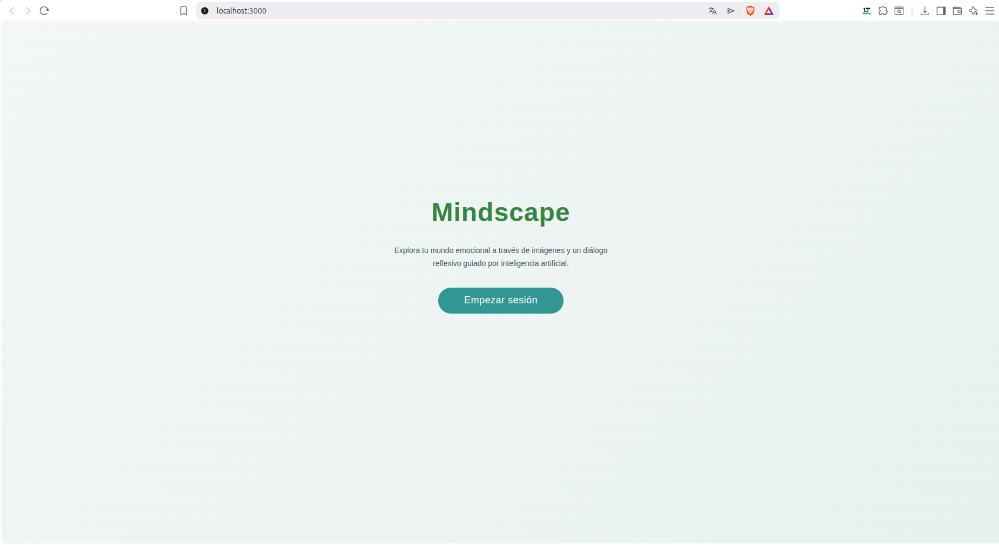
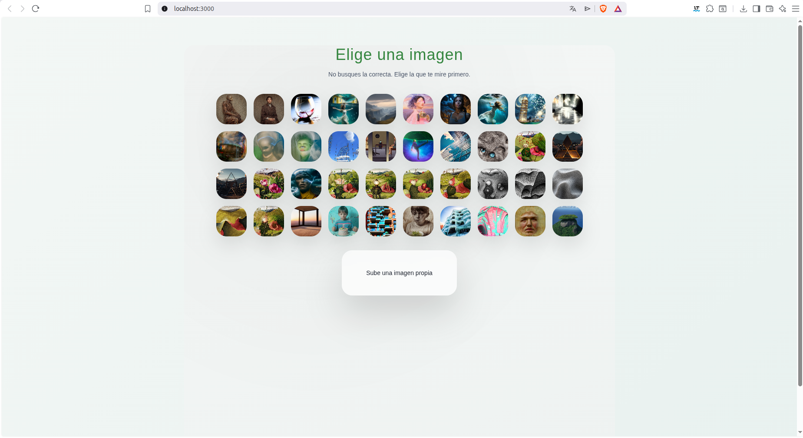
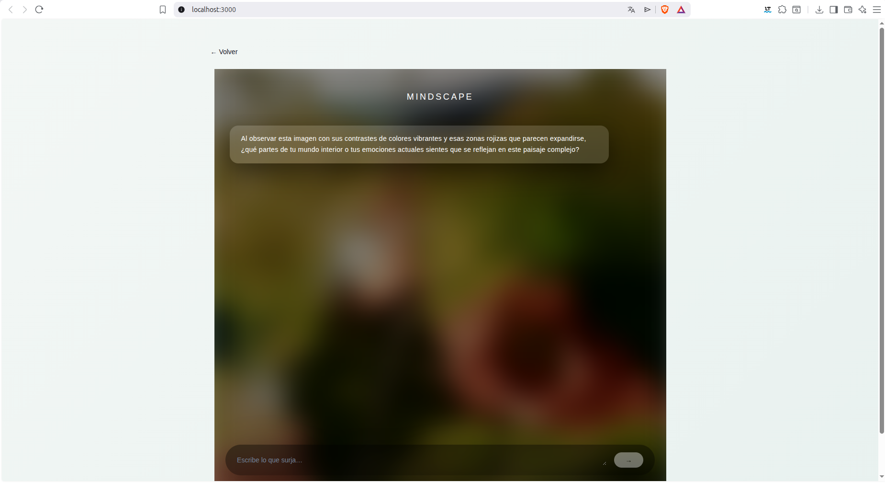

# MINDSCAPE

> Plataforma web de inteligencia artificial multimodal que combina el análisis de imágenes con una conversación contextualizada para fomentar la autoexploración.



**MINDSCAPE** es un proyecto desarrollado como Trabajo de Fin de Grado en Ingeniería Informática en la Universitat de Barcelona.

La aplicación utiliza una imagen como punto de partida para iniciar una conversación con un modelo de inteligencia artificial multimodal. A partir de la imagen seleccionada, el sistema genera una conversación contextualizada que puede evolucionar de forma natural hasta que la usuaria decide finalizar la sesión.

---

## 🎥 Demo

La demostración muestra el flujo principal de la aplicación:

**Inicio → Selección de imagen → Conversación → Finalización de sesión → Resumen**

Durante la demo se muestra:

1. Acceso al menú principal.
2. Selección de una imagen.
3. Inicio de la conversación a partir de la imagen.
4. Interacción con el modelo mediante el chat.
5. Finalización de la sesión.
6. Acceso al resumen de la conversación.

> La imagen funciona como punto de partida de la conversación y permite incorporar información visual al contexto del diálogo.

---

## 📸 Aplicación

### Menú principal


### Selección de imagen



### Conversación multimodal



---

## ✨ Funcionalidades

- 🖼️ **Interacción multimodal** a partir de imágenes y texto.
- 💬 **Conversaciones contextualizadas** utilizando la imagen seleccionada como punto de partida.
- 🧠 **Integración con Gemini 2.5 Flash** para el procesamiento multimodal.
- 🔄 **Gestión del historial conversacional** para mantener el contexto durante la sesión.
- 🤖 **Generación dinámica de respuestas** mediante prompts adaptados al estado de la conversación.
- 🛑 **Detección del final de la sesión** mediante una señal de control gestionada por el modelo.
- 📝 **Generación de resúmenes** al finalizar la conversación.
- 📄 **Exportación del resumen en PDF**.
- 🔌 **API REST** para la comunicación entre frontend y backend.
- 📚 **Documentación automática de la API mediante Swagger**.

---

## 🏗️ Arquitectura

MINDSCAPE utiliza una arquitectura cliente-servidor en la que el frontend se encarga de la interacción con la usuaria y el backend gestiona la lógica de negocio y la comunicación con el modelo de inteligencia artificial.

```text
                         ┌─────────────────────┐
                         │       Usuaria       │
                         └──────────┬──────────┘
                                    │
                                    ▼
                         ┌─────────────────────┐
                         │       React         │
                         │      Frontend       │
                         └──────────┬──────────┘
                                    │
                               REST API
                                    │
                                    ▼
                         ┌─────────────────────┐
                         │      FastAPI        │
                         │       Backend       │
                         └──────────┬──────────┘
                                    │
                                    ▼
                         ┌─────────────────────┐
                         │   Gemini 2.5 Flash  │
                         │    Modelo de IA     │
                         └─────────────────────┘
```

### Flujo de una conversación

```text
1. Selección de imagen
          │
          ▼
    /start_chat
          │
          ▼
2. Conversación
          │
          ▼
   /continue_chat
          │
          ▼
3. Finalización
          │
          ▼
   /summary_chat
          │
          ▼
    /summary_pdf
```

El frontend envía al backend el historial de la conversación. El backend construye los prompts necesarios y se comunica con Gemini, devolviendo respuestas estructuradas en JSON.

---

## 🔌 API

El backend está desarrollado con **FastAPI** y proporciona diferentes endpoints para gestionar el ciclo de vida de una conversación.

| Endpoint | Método | Descripción |
|---|---|---|
| `/health` | `GET` | Comprueba el estado del backend. |
| `/start_chat` | `POST` | Procesa la imagen e inicia la conversación. |
| `/continue_chat` | `POST` | Continúa una conversación utilizando su historial. |
| `/summary_chat` | `POST` | Genera el resumen de una conversación finalizada. |
| `/summary_pdf` | `POST` | Genera el resumen en formato PDF. |

Las respuestas relacionadas con la conversación utilizan una estructura JSON que permite controlar tanto el mensaje generado como el estado de la sesión:

```json
{
  "message": "Respuesta generada por el modelo",
  "finished": false
}
```

El campo `finished` permite determinar cuándo la conversación debe finalizar.

---

## 🧠 Inteligencia Artificial

MINDSCAPE utiliza **Gemini 2.5 Flash** como modelo de inteligencia artificial multimodal.

El modelo recibe información visual y textual y genera respuestas teniendo en cuenta el contexto de la conversación.

La aplicación utiliza prompts diferenciados para:

- Iniciar la conversación a partir de una imagen.
- Mantener el contexto durante el diálogo.
- Fomentar la autoexploración.
- Detectar señales de finalización.
- Generar una reflexión final.
- Crear el resumen de la conversación.

La comunicación con el modelo se realiza desde el backend, manteniendo separada la lógica de inteligencia artificial de la interfaz de usuario.

---

## 🛠️ Tecnologías

### Frontend

- **React**
- **JavaScript**
- **Chakra UI**
- **Axios**
- **Framer Motion**

### Backend

- **Python**
- **FastAPI**
- **Uvicorn**
- **REST API**

### Inteligencia Artificial

- **Google Gemini**
- **Gemini 2.5 Flash**
- **IA multimodal**
- **Prompt Engineering**

### Otros

- **JSON**
- **Swagger / OpenAPI**
- **ReportLab**
- **Git / GitHub**

---

## 📁 Estructura del proyecto

```text
chatbot_mental/
│
├── backend/
│   ├── main.py
│   ├── models.py
│   ├── requirements.txt
│   └── ...
│
├── frontend/
│   ├── src/
│   │   ├── components/
│   │   ├── ...
│   │   └── App.js
│   ├── package.json
│   └── ...
│
├── docs/
│   └── images/
│       ├── mindscape-home.png
│       ├── mindscape-image-selection.png
│       ├── mindscape-chat.png
│       └── mindscape-summary.png
│
├── .gitignore
└── README.md
```

---

## 🚀 Instalación

### Requisitos

- Python 3.8 o superior
- Node.js
- npm
- Una API Key de Google Gemini

### 1. Clonar el repositorio

```bash
git clone https://github.com/Samot2003/chatbot_mental.git
cd chatbot_mental
```

### 2. Configurar el backend

```bash
cd backend
python -m venv venv
```

Activar el entorno virtual.

**Windows:**

```bash
venv\Scripts\activate
```

**Linux/macOS:**

```bash
source venv/bin/activate
```

Instalar las dependencias:

```bash
pip install -r requirements.txt
```

### 3. Configurar la API Key

Crear un archivo `.env` dentro de `backend/`:

```env
GOOGLE_API_KEY=TU_API_KEY
```

La API Key no debe incluirse directamente en el código ni subirse al repositorio.

### 4. Iniciar el backend

```bash
uvicorn main:app --reload
```

Backend:

```text
http://localhost:8000
```

Documentación interactiva:

```text
http://localhost:8000/docs
```

### 5. Configurar el frontend

En una nueva terminal:

```bash
cd frontend
npm install
```

### 6. Iniciar el frontend

```bash
npm start
```

Aplicación:

```text
http://localhost:3000
```

---

## 🔐 Variables de entorno

El proyecto utiliza variables de entorno para mantener las credenciales fuera del código fuente.

Ejemplo:

```env
GOOGLE_API_KEY=TU_API_KEY
```

El archivo `.env` debe estar incluido en `.gitignore`.

Se recomienda utilizar un archivo `.env.example`:

```env
GOOGLE_API_KEY=
```

---

## 👨‍💻 Desarrollo

MINDSCAPE fue desarrollado de forma modular, separando la interfaz, la lógica de negocio y la integración con el modelo de inteligencia artificial.

Entre las principales tareas de desarrollo se incluyen:

- Diseño de la arquitectura cliente-servidor.
- Desarrollo del frontend con React.
- Desarrollo del backend con FastAPI.
- Diseño e implementación de la API REST.
- Integración de Gemini 2.5 Flash.
- Implementación del procesamiento multimodal.
- Gestión del historial de conversaciones.
- Diseño de prompts para las diferentes fases del diálogo.
- Implementación del control de finalización de sesiones.
- Generación de resúmenes de conversaciones.
- Generación de documentos PDF.
- Diseño y desarrollo de la interfaz de usuario.
- Pruebas de usabilidad de la aplicación.

---

## 🎓 Trabajo de Fin de Grado

MINDSCAPE fue desarrollado como **Trabajo de Fin de Grado del Grado en Ingeniería Informática de la Universitat de Barcelona**.

El proyecto explora el uso de modelos de inteligencia artificial multimodal como herramienta para iniciar y acompañar procesos de autoexploración a partir de estímulos visuales.

La aplicación se plantea como un **prototipo experimental** y no como un sustituto de profesionales de la salud mental.

---

## 📄 Documentación

La documentación completa del proyecto se encuentra en la memoria del Trabajo de Fin de Grado.

El documento describe:

- Diseño y requisitos del sistema.
- Arquitectura de la aplicación.
- Implementación del frontend.
- Implementación del backend.
- Integración con Gemini.
- Diseño de prompts.
- Pruebas y evaluación.
- Consideraciones éticas.
- Resultados y conclusiones.

---

## 👤 Autor

### Tomás Aladjem Ramallo

Ingeniero Informático · Software · Backend · Full Stack · IA

- **GitHub:** https://github.com/Samot2003
- **LinkedIn:** https://www.linkedin.com/in/tomas-aladjem/

---

## ⚠️ Aviso

MINDSCAPE es un proyecto académico y experimental desarrollado como Trabajo de Fin de Grado.

La aplicación utiliza inteligencia artificial generativa y sus respuestas no deben interpretarse como diagnóstico, tratamiento o asesoramiento profesional de salud mental.
