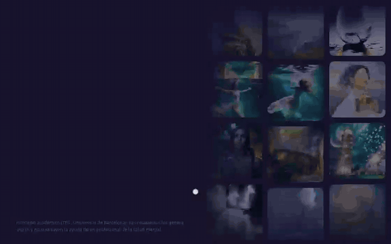
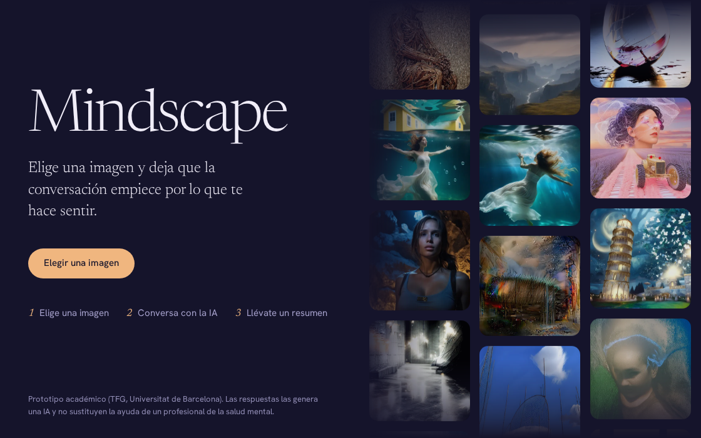
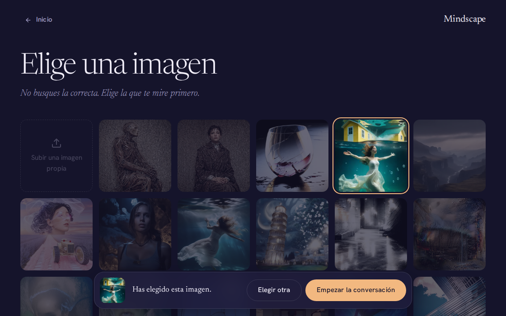
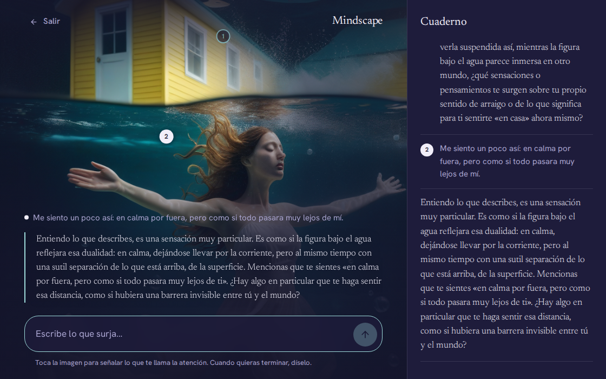
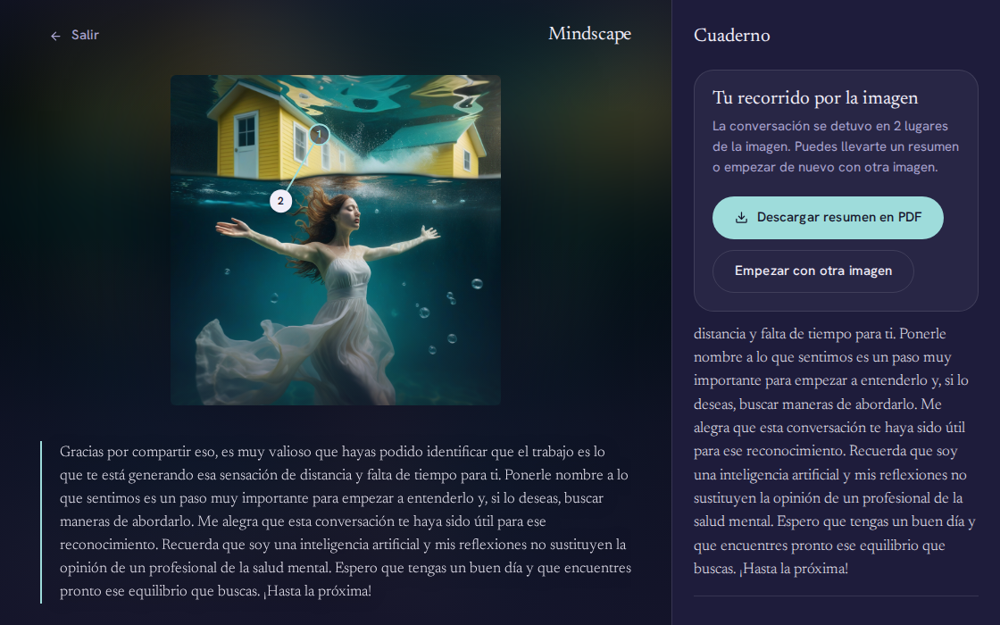
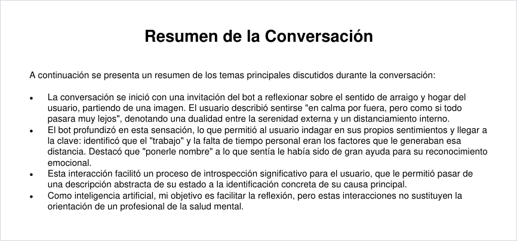

# MINDSCAPE

> Plataforma web de inteligencia artificial multimodal que combina el análisis de imágenes con una conversación contextualizada para fomentar la autoexploración.



**MINDSCAPE** es un proyecto desarrollado como Trabajo de Fin de Grado en Ingeniería Informática en la Universitat de Barcelona.

La aplicación utiliza una imagen como punto de partida para iniciar una conversación con un modelo de inteligencia artificial multimodal. A partir de la imagen seleccionada, el sistema genera una conversación contextualizada que puede evolucionar de forma natural hasta que la usuaria decide finalizar la sesión.

---

## 🎥 Demo

La animación superior muestra una sesión real con Gemini 2.5 Flash, de principio a fin:

**Inicio → Selección de imagen → Pregunta inicial generada a partir de la imagen → Conversación → Cierre de la sesión → Resumen en PDF**

Las esperas a las respuestas del modelo se han acortado para que la demo sea más ágil. También está disponible en [vídeo (MP4)](docs/images/mindscape-demo.mp4).

---

## 📸 Aplicación

### Menú principal

La interfaz vive en penumbra para que las imágenes sean protagonistas: la propia galería se desliza lentamente junto a la presentación.



### Selección de imagen

Galería de imágenes predeterminadas o subida de una imagen propia. Al elegir una, el resto se atenúa y aparece la opción de empezar la conversación.



### Conversación dentro de la imagen

Siguiendo el enfoque de la arteterapia, la imagen no es un adjunto sino el espacio de la conversación: ocupa toda la pantalla y el diálogo se escribe sobre ella.

- **La IA señala.** Cuando el modelo habla de una zona concreta (gracias a la capacidad de Gemini para localizar elementos en una imagen), la cámara se acerca lentamente a esa zona y la ilumina.
- **La usuaria señala.** Basta con tocar la imagen para indicar qué le llama la atención («¿Qué ves aquí?»). El modelo recibe la imagen y el punto exacto, y responde mirando esa zona.
- **Cada punto deja una marca** numerada sobre la imagen. El cuaderno lateral recoge la conversación completa, y cada mensaje enlaza con su marca.
- La imagen tiñe la interfaz: su color dominante se convierte en el acento del chat.



### Fin de la sesión: el recorrido por la imagen

Cuando la usuaria da la conversación por terminada, el modelo se despide con una breve reflexión. La imagen se aleja, queda enmarcada como una obra y una línea une en orden todos los puntos en los que se detuvo la conversación: el recorrido de la mirada por ese paisaje mental. Desde ahí se puede descargar un resumen en PDF o empezar de nuevo con otra imagen.

<p>
  
  
</p>

---

## ✨ Funcionalidades

- 🖼️ **Interacción multimodal** a partir de imágenes y texto.
- 💬 **Conversaciones contextualizadas** utilizando la imagen seleccionada como punto de partida.
- 📍 **Diálogo sobre la imagen**: la IA y la usuaria pueden señalar zonas concretas, que quedan marcadas y forman el recorrido de la conversación.
- 🧠 **Integración con Gemini 2.5 Flash** para el procesamiento multimodal.
- 🔄 **Gestión del historial conversacional** para mantener el contexto durante la sesión.
- 🤖 **Generación dinámica de respuestas** mediante prompts adaptados al estado de la conversación.
- 🛑 **Detección del final de la sesión** mediante una señal de control gestionada por el modelo.
- 📝 **Generación de resúmenes** al finalizar la conversación.
- 📄 **Exportación del resumen en PDF**.
- 🎨 **Interfaz inmersiva** que adapta su color a la imagen elegida, responsive y accesible (contraste AA, navegación por teclado, respeto a `prefers-reduced-motion`).
- 🔌 **API REST** para la comunicación entre frontend y backend.
- 📚 **Documentación automática de la API mediante Swagger**.

---

## 🏗️ Arquitectura

MINDSCAPE utiliza una arquitectura cliente-servidor en la que el frontend se encarga de la interacción con la usuaria y el backend gestiona la lógica de negocio y la comunicación con el modelo de inteligencia artificial.

```text
                         ┌─────────────────────┐
                         │       Usuaria       │
                         └──────────┬──────────┘
                                    │
                                    ▼
                         ┌─────────────────────┐
                         │       React         │
                         │      Frontend       │
                         └──────────┬──────────┘
                                    │
                               REST API
                                    │
                                    ▼
                         ┌─────────────────────┐
                         │      FastAPI        │
                         │       Backend       │
                         └──────────┬──────────┘
                                    │
                                    ▼
                         ┌─────────────────────┐
                         │   Gemini 2.5 Flash  │
                         │    Modelo de IA     │
                         └─────────────────────┘
```

### Flujo de una conversación

```text
1. Selección de imagen
          │
          ▼
    /start_chat
          │
          ▼
2. Conversación
          │
          ▼
   /continue_chat
          │
          ▼
3. Finalización
          │
          ▼
   /summary_chat
          │
          ▼
    /summary_pdf
```

El frontend envía al backend el historial de la conversación. El backend construye los prompts necesarios y se comunica con Gemini, devolviendo respuestas estructuradas en JSON.

---

## 🔌 API

El backend está desarrollado con **FastAPI** y proporciona diferentes endpoints para gestionar el ciclo de vida de una conversación.

| Endpoint | Método | Descripción |
|---|---|---|
| `/health` | `GET` | Comprueba el estado del backend. |
| `/start_chat` | `POST` | Procesa la imagen e inicia la conversación. |
| `/continue_chat` | `POST` | Continúa una conversación utilizando su historial y, opcionalmente, la imagen (para que el modelo vea las zonas señaladas). |
| `/summary_chat` | `POST` | Genera el resumen de una conversación finalizada. |
| `/summary_pdf` | `POST` | Genera el resumen en formato PDF. |

`/start_chat` y `/continue_chat` reciben `multipart/form-data`: la imagen (`file`) y, en el caso de `/continue_chat`, el historial como JSON en el campo `history`. Cada mensaje del historial puede incluir la zona que señaló la usuaria:

```json
[
  { "sender": "bot", "text": "¿Qué sientes al ver esa casa?", "focus": { "x": 0.52, "y": 0.18 } },
  { "sender": "user", "text": "Me agobia un poco", "focus": { "x": 0.41, "y": 0.22 } }
]
```

Las respuestas relacionadas con la conversación utilizan una estructura JSON que permite controlar el mensaje generado, la zona de la imagen a la que se refiere y el estado de la sesión:

```json
{
  "message": "Respuesta generada por el modelo",
  "focus": { "x": 0.52, "y": 0.18 },
  "finished": false
}
```

- `focus` indica la zona de la imagen de la que habla el modelo, en coordenadas normalizadas de 0 a 1 (o `null`).
- `finished` permite determinar cuándo la conversación debe finalizar.

Los errores se devuelven también en JSON (`{"error": "..."}`) para que el frontend pueda mostrarlos a la usuaria:

| Código | Situación |
|---|---|
| `400` | El archivo enviado no es una imagen válida. |
| `429` | Se ha alcanzado el límite de uso de la API de Gemini. |
| `502` | Error al comunicarse con Gemini (por ejemplo, una API Key no válida). |

---

## 🧠 Inteligencia Artificial

MINDSCAPE utiliza **Gemini 2.5 Flash** como modelo de inteligencia artificial multimodal.

El modelo recibe información visual y textual y genera respuestas teniendo en cuenta el contexto de la conversación.

La aplicación utiliza prompts diferenciados para:

- Iniciar la conversación a partir de una imagen.
- Mantener el contexto durante el diálogo.
- Fomentar la autoexploración.
- Detectar señales de finalización.
- Generar una reflexión final.
- Crear el resumen de la conversación.

La comunicación con el modelo se realiza desde el backend, manteniendo separada la lógica de inteligencia artificial de la interfaz de usuario.

---

## 🛠️ Tecnologías

### Frontend

- **React**
- **JavaScript**
- **Chakra UI**
- **Axios**
- **Framer Motion**

### Backend

- **Python**
- **FastAPI**
- **Uvicorn**
- **REST API**

### Inteligencia Artificial

- **Google Gemini**
- **Gemini 2.5 Flash**
- **IA multimodal**
- **Prompt Engineering**

### Otros

- **JSON**
- **Swagger / OpenAPI**
- **ReportLab**
- **Git / GitHub**

---

## 📁 Estructura del proyecto

```text
MINDSCAPE-Multimodal-AI-Assistant/
│
├── chatbot_mental/
│   ├── backend/
│   │   ├── main.py            # API REST (FastAPI)
│   │   ├── controllers.py     # Lógica de negocio y generación del PDF
│   │   ├── models.py          # Integración con Gemini y prompts
│   │   ├── requirements.txt
│   │   ├── start_server.sh
│   │   └── .env.example
│   │
│   └── frontend/
│       ├── public/
│       ├── src/
│       │   ├── assets/images/ # Imágenes predeterminadas
│       │   ├── components/    # Selector de imagen y chat
│       │   ├── services/      # Cliente de la API (Axios)
│       │   ├── theme/
│       │   └── App.jsx
│       ├── package.json
│       └── start_frontend.sh
│
├── docs/
│   └── images/                # Capturas y demo del README
│
├── .gitignore
└── README.md
```

---

## 🚀 Instalación

### Requisitos

- Python 3.8 – 3.12
- Node.js y npm
- Una API Key de Google Gemini ([Google AI Studio](https://aistudio.google.com/apikey))

### 1. Clonar el repositorio

```bash
git clone https://github.com/Samot2003/MINDSCAPE-Multimodal-AI-Assistant.git
cd MINDSCAPE-Multimodal-AI-Assistant/chatbot_mental
```

### 2. Configurar el backend

```bash
cd backend
python -m venv .venv
```

Activar el entorno virtual.

**Windows:**

```bash
.venv\Scripts\activate
```

**Linux/macOS:**

```bash
source .venv/bin/activate
```

Instalar las dependencias:

```bash
pip install -r requirements.txt
```

### 3. Configurar la API Key

Copiar la plantilla `.env.example` a `.env` dentro de `backend/` y añadir la clave:

```bash
cp .env.example .env
```

```env
GOOGLE_API_KEY=TU_API_KEY
```

El archivo `.env` está excluido en `.gitignore`: la API Key no debe incluirse en el código ni subirse al repositorio.

> **Nota:** el plan gratuito de la API de Gemini limita el número de peticiones diarias por modelo. Cada mensaje del chat, el inicio de la conversación y cada resumen consumen una petición. Si se alcanza el límite, la aplicación muestra un aviso y hay que esperar al reinicio de la cuota.

### 4. Iniciar el backend

```bash
uvicorn main:app --reload
```

O bien, con el script incluido (usa el entorno `.venv` si existe):

```bash
./start_server.sh
```

Backend:

```text
http://localhost:8000
```

Documentación interactiva (Swagger):

```text
http://localhost:8000/docs
```

### 5. Configurar el frontend

En una nueva terminal, desde `chatbot_mental/`:

```bash
cd frontend
npm install
```

### 6. Iniciar el frontend

```bash
npm start
```

Aplicación:

```text
http://localhost:3000
```

> El frontend se comunica con el backend en `http://localhost:8000` (configurado en `src/services/api.js`).

### 7. Ejecutar las pruebas (opcional)

Las pruebas del backend usan un modelo de Gemini simulado, por lo que no necesitan API Key ni consumen cuota:

```bash
cd backend
pip install -r requirements-dev.txt
python -m pytest tests
```

---

## 👨‍💻 Desarrollo

MINDSCAPE fue desarrollado de forma modular, separando la interfaz, la lógica de negocio y la integración con el modelo de inteligencia artificial.

Entre las principales tareas de desarrollo se incluyen:

- Diseño de la arquitectura cliente-servidor.
- Desarrollo del frontend con React.
- Desarrollo del backend con FastAPI.
- Diseño e implementación de la API REST.
- Integración de Gemini 2.5 Flash.
- Implementación del procesamiento multimodal.
- Gestión del historial de conversaciones.
- Diseño de prompts para las diferentes fases del diálogo.
- Implementación del control de finalización de sesiones.
- Generación de resúmenes de conversaciones.
- Generación de documentos PDF.
- Diseño y desarrollo de la interfaz de usuario.
- Pruebas de usabilidad de la aplicación.

---

## 🎓 Trabajo de Fin de Grado

MINDSCAPE fue desarrollado como **Trabajo de Fin de Grado del Grado en Ingeniería Informática de la Universitat de Barcelona**.

El proyecto explora el uso de modelos de inteligencia artificial multimodal como herramienta para iniciar y acompañar procesos de autoexploración a partir de estímulos visuales.

La aplicación se plantea como un **prototipo experimental** y no como un sustituto de profesionales de la salud mental.

---

## 📄 Documentación

La documentación completa del proyecto se encuentra en la memoria del Trabajo de Fin de Grado.

El documento describe:

- Diseño y requisitos del sistema.
- Arquitectura de la aplicación.
- Implementación del frontend.
- Implementación del backend.
- Integración con Gemini.
- Diseño de prompts.
- Pruebas y evaluación.
- Consideraciones éticas.
- Resultados y conclusiones.

---

## 👤 Autor

### Tomás Aladjem Ramallo

Ingeniero Informático · Software · Backend · Full Stack · IA

- **GitHub:** https://github.com/Samot2003
- **LinkedIn:** https://www.linkedin.com/in/tomas-aladjem/

---

## ⚠️ Aviso

MINDSCAPE es un proyecto académico y experimental desarrollado como Trabajo de Fin de Grado.

La aplicación utiliza inteligencia artificial generativa y sus respuestas no deben interpretarse como diagnóstico, tratamiento o asesoramiento profesional de salud mental.
